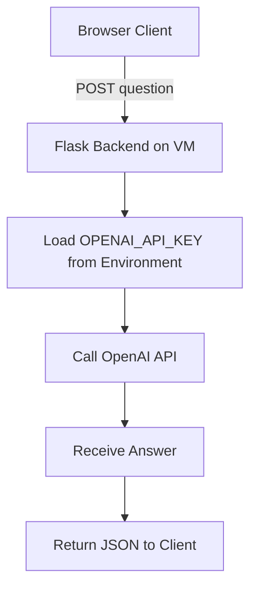

# LLM Flask Backend on GCP Compute Engine

---

## 1. Introduction

This project provides a Flask backend API that accepts questions from a web client and answers them using the OpenAI GPT model (via a single API call). It runs on Google Cloud Compute Engine (e2-micro) VM securely, without storing the OpenAI API key in code or files.

✅ The VM holds the API key as an environment variable.\
✅ The backend exposes an `/ask` endpoint.\
✅ You can just **open the included HTML file in your browser and ask questions**.

---

## 2. Requirements

-   Google Cloud account with billing enabled
-   Compute Engine VM (e2-micro, Ubuntu 22.04 LTS)
-   Python 3.8+
-   Flask
-   Flask-CORS
-   openai Python package

---

## 3. Setup Guide

### 3.1 Create GCP VM

1. Go to Google Cloud Console → Compute Engine → Create Instance.
2. Choose:
    - Machine type: **e2-micro**
    - Boot disk: **Ubuntu 22.04 LTS**
    - Firewall: ✅ Allow HTTP traffic
3. Click **Create**.

### 3.2 SSH into VM

```bash
gcloud compute ssh YOUR_VM_NAME
```

### 3.3 Install Dependencies

```bash
sudo apt update
sudo apt install -y python3 python3-venv python3-pip
```

### 3.4 Upload Code

```bash
gcloud compute scp app.py YOUR_VM_NAME:~/llm_backend
```

### 3.5 Set Up Virtual Environment

```bash
cd ~/llm_backend
python3 -m venv venv
source venv/bin/activate
pip install -r requirements.txt
```

**requirements.txt:**

```
Flask
Flask-CORS
openai
```

### 3.6 Set OpenAI API Key

```bash
echo 'export OPENAI_API_KEY="sk-your-api-key"' >> ~/.bashrc
source ~/.bashrc
```

### 3.7 Start Flask App

```bash
source venv/bin/activate
python app.py
```

✅ The server listens on `0.0.0.0:8080`.

### 3.8 Open Port 8080

In GCP → VPC network → Firewall rules → Create rule to allow TCP port **8080**.

### 3.9 Optional: Production with Gunicorn

```bash
pip install gunicorn
gunicorn -w 4 -b 0.0.0.0:8080 app:app
```

---

## 4. How It Works

✅ Client (browser) sends POST to `/ask` with a question.\
✅ Flask server calls OpenAI in one chat completion request.\
✅ Returns answer as JSON.\
✅ CORS enabled to allow your browser to talk to the VM.

---

## 5. Logic and Implementation

-   OPENAI_API_KEY is securely loaded from the VM environment.
-   Flask-CORS injects Access-Control-Allow-Origin headers.
-   Receives JSON with `question`.
-   Calls OpenAI API.
-   Returns JSON answer.

---

## 6. Mermaid Flowchart



---

## 7. Weaknesses and Future Improvements

-   No HTTPS (recommend Nginx + certbot)
-   No authentication (anyone can access the endpoint)
-   No rate limiting
-   No advanced validation
-   Stateless—no conversation memory
-   Logs only to stdout
-   Recommend Google Secret Manager for secrets

---

## 8. Example Request (HTML Frontend)

✅ Just **open this HTML file in your browser and ask:**

```html
<!DOCTYPE html>
<html lang="en">
	<head>
		<meta charset="UTF-8" />
		<title>LLM Ask</title>
	</head>
	<body>
		<h1>Ask the LLM</h1>
		<input
			type="text"
			id="question"
			placeholder="Type your question"
			size="50"
		/>
		<button onclick="ask()">Ask</button>
		<pre id="response"></pre>

		<script>
			async function ask() {
				const question = document.getElementById("question").value;
				const responseElem = document.getElementById("response");
				responseElem.textContent = "Loading...";

				const res = await fetch("http://YOUR_VM_EXTERNAL_IP:8080/ask", {
					method: "POST",
					headers: { "Content-Type": "application/json" },
					body: JSON.stringify({ question }),
				});

				const data = await res.json();
				responseElem.textContent = data.answer || JSON.stringify(data);
			}
		</script>
	</body>
</html>
```

✅ Replace `YOUR_VM_EXTERNAL_IP` with your VM's IP.
